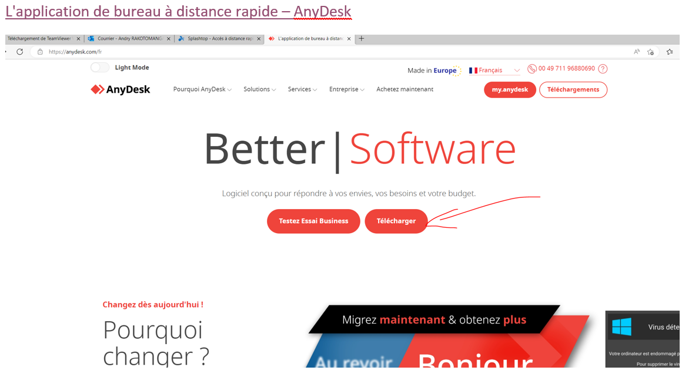
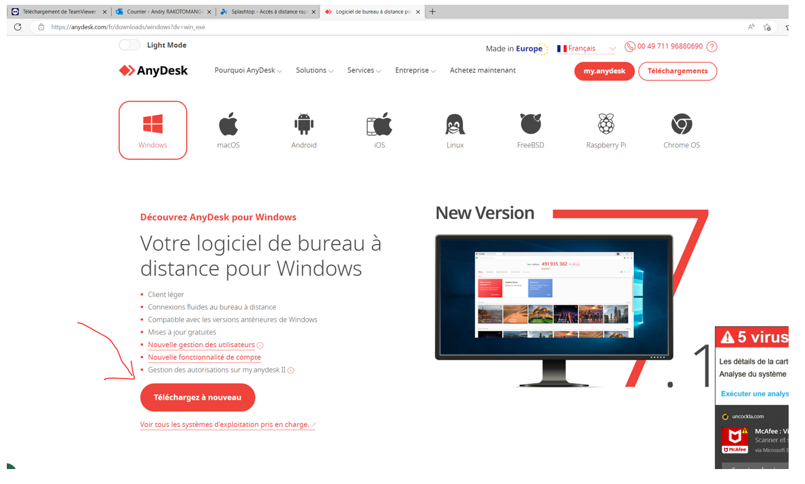
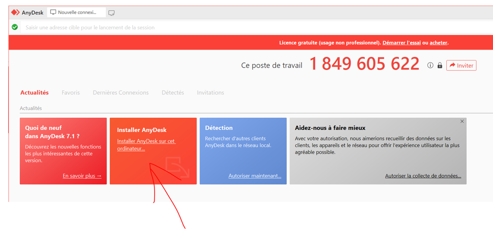
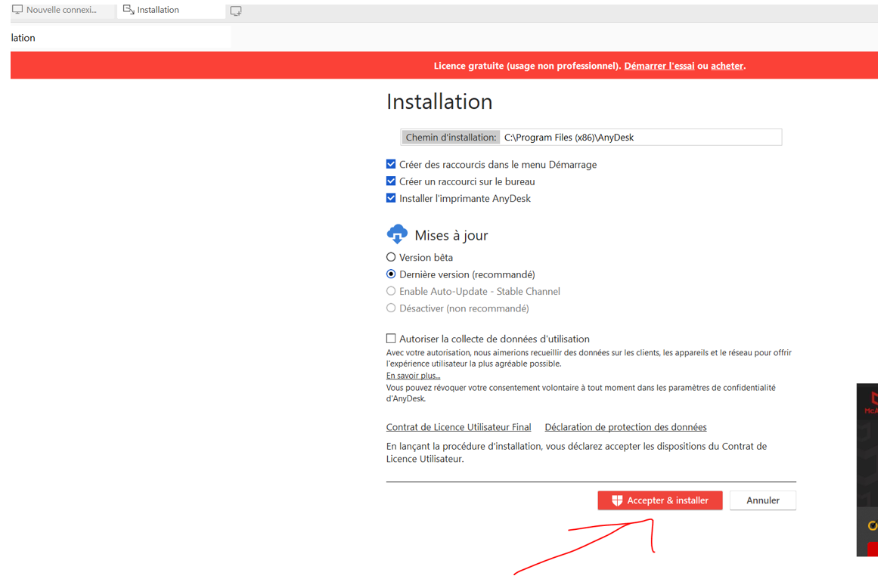
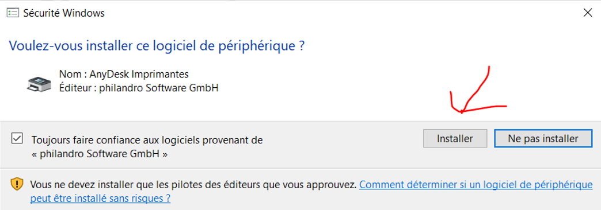
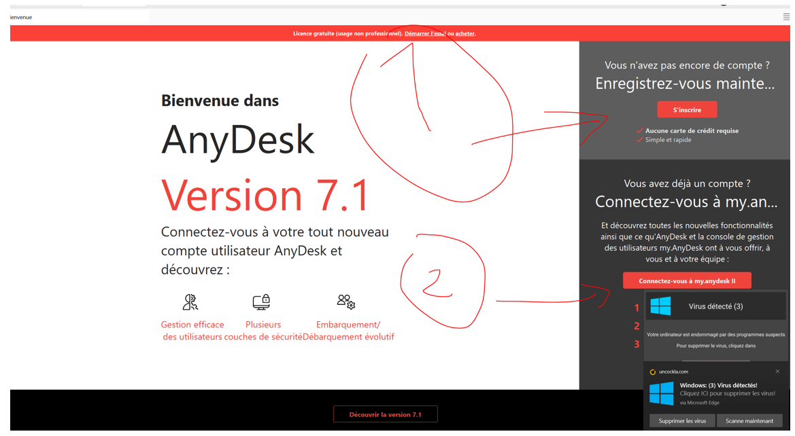
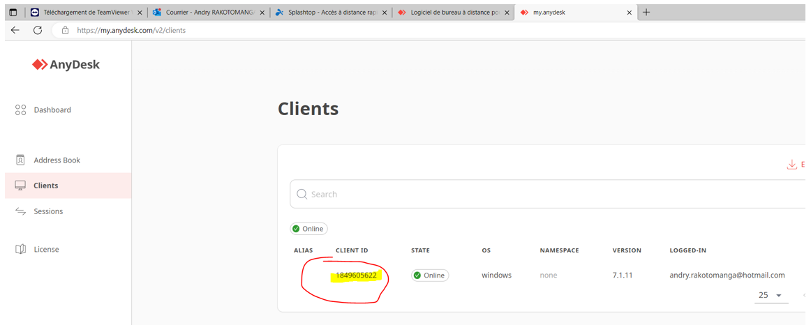
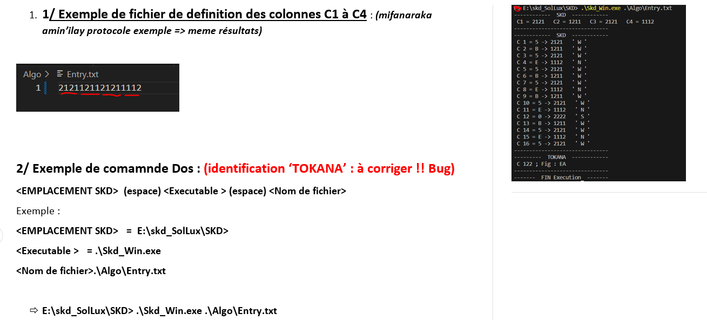

# Guide d'Installation et d'Utilisation - TeamViewer & AnyDesk

Ce document présente la procédure pas à pas pour installer et exécuter les applications de bureau à distance.

> 💡 **Téléchargement alternatif :** Vous pouvez récupérer l'application AnyDesk depuis son site officiel [AnyDesk](https://anydesk.com/fr).

> 💡 **Téléchargement alternatif :** Vous pouvez également récupérer l'application TeamViewer depuis son site officiel [TeamViewer](https://www.teamviewer.com/fr/download/portal/windows/).

---

## Sommaire

* [1. Procédure d'installation de AnyDesk](#1-procédure-dinstallation-de-anydesk)
* [2. Procédure d'installation de TeamViewer](#2-procédure-dinstallation-de-teamviewer)
* [3. Procédure d'exécution application](#3-procédure-dexécution-application)

---

## 1. Procédure d'installation de AnyDesk

Pour installer AnyDesk sur votre système, veuillez suivre les étapes ci-dessous :

---

## 2. Procédure d'installation de TeamViewer

Pour installer TeamViewer sur votre système, veuillez suivre les étapes ci-dessous :

1. **Téléchargement :** Rendez-vous sur le site officiel de TeamViewer et téléchargez le programme d'installation correspondant à votre système d'exploitation.
2. **Lancement du programme :** Double-cliquez sur le fichier téléchargé pour démarrer l'assistant d'installation.
3. **Configuration :** 
   * Sélectionnez le type d'installation souhaité (par exemple, *Installation par défaut* ou *Installer pour un usage personnel/commercial*).
   * Acceptez les conditions du contrat de licence de l'utilisateur final (CLUF).
4. **Finalisation :** Patientez pendant que le programme copie les fichiers nécessaires. Une fois l'opération terminée, l'icône de TeamViewer apparaîtra sur votre bureau ou dans votre menu d'applications.

---

## 3. Procédure d'exécution application

Pour lancer et utiliser l'application après son installation, référez-vous à l'illustration ci-dessous :

*L'interface principale de l'application vous permettra d'obtenir votre identifiant et votre mot de passe pour établir une connexion à distance.*